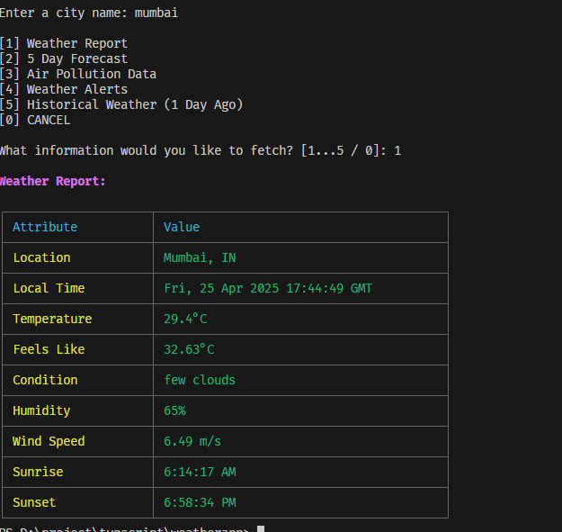
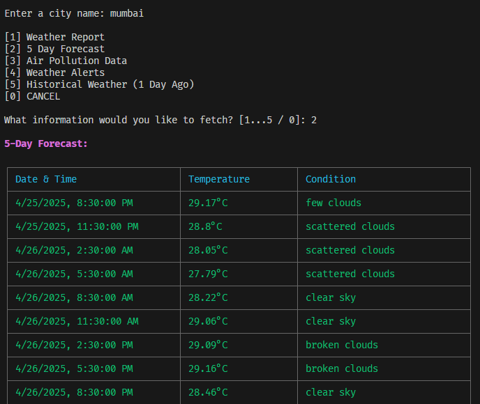
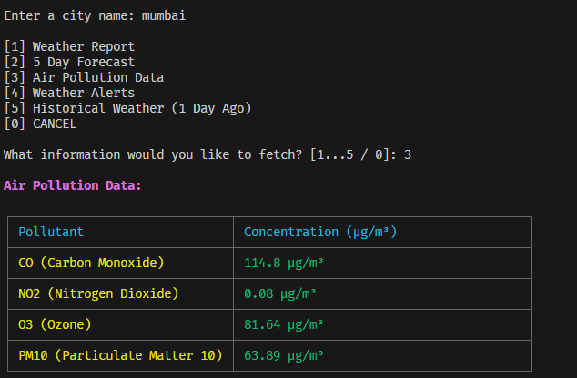

# Weather Application

A command-line weather application that fetches real-time weather data, 5-day/3-hour forecast, historical weather data, air pollution levels, and weather alerts using the OpenWeatherMap API. This application is built with **Node.js** and utilizes various external libraries to enhance the functionality and user experience.


## Screenshots

Here are some screenshots of the application in action:


*Current weather display*


*5-day/3-hour weather forecast*


*Air pollution levels*


## Features

- **Current Weather**: Displays the current weather including temperature, humidity, wind speed, and more.
- **5-Day/3-Hour Forecast**: Provides weather forecasts for the next 5 days, with 3-hour intervals.
- **Historical Weather**: Fetches weather data for a specific date in the past.
- **Air Pollution Data**: Shows the current air pollution levels (CO, NO2, O3, PM10).
- **Weather Alerts**: Displays any active weather alerts for a specific city.

## Requirements

- Node.js (version 14 or later)
- npm (Node Package Manager)

## Installation

1. Clone this repository to your local machine:

   ```bash
   git clone https://github.com/your-username/weather-application.git
   ```

2. Navigate to the project directory:

   ```bash
   cd weather-application
   ```

3. Install the required dependencies:

   ```bash
   npm install
   ```

4. Create a `.env` file in the root of the project directory and add your OpenWeatherMap API key:

   ```text
   API_KEY=your_api_key_here
   ```

5. Run the application:

   ```bash
   node app.js
   ```

## Usage

1. Run the application using `node app.js` in the terminal.
2. The program will prompt you to enter a city name.
3. Based on the input, the application will display:
   - Current weather
   - 5-day forecast (with 3-hour intervals)
   - Historical weather for a given date
   - Air pollution data
   - Weather alerts (if any)

### Example

```bash
Enter a city name: London
```

The program will return the weather information in a table format, such as:

- Current Temperature
- Weather Condition
- Wind Speed
- Humidity
- Air Pollution Levels

## Libraries Used

- [axios](https://www.npmjs.com/package/axios) - Promise-based HTTP client for the browser and Node.js
- [dotenv](https://www.npmjs.com/package/dotenv) - Loads environment variables from a `.env` file
- [chalk](https://www.npmjs.com/package/chalk) - Terminal string styling
- [cli-table3](https://www.npmjs.com/package/cli-table3) - Create and display tables in the terminal
- [readline-sync](https://www.npmjs.com/package/readline-sync) - Simple synchronous readline interface for Node.js
